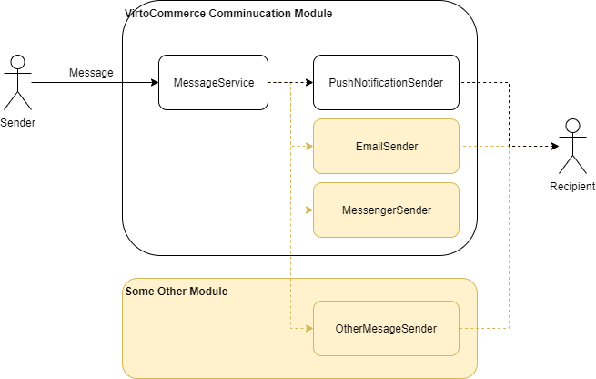

# Main concept
This article describes the internal structure of the VirtoCommerce Communication Module that allows developers to create communication systems for their Virto-based applications.

## Overview
_VirtoCommerce Communication_ is a basic module for messaging, it does not contain an API for interacting with services, and a UI for displaying messages to users. Only a data storage system and services for working with them.

Centralized storage of messages allows for messaging regardless of which application the user uses. Separate implementation of the UI for communications in each application allows for flexible customization of the appearance and UX depending on the requirements of the project.

In this diagram:

- Black - the implemented message processing mechanism

- Green - an example of implementing communication between the Operator and the Vendor. The Operator works from his workplace based on the VirtoCommerce Platform, the Vendor uses communications on the Vendor Portal. This scenario was implemented in [VirtoCommerce Marketplace Communication module](https://github.com/VirtoCommerce/vc-module-marketplace-communication)

- Orange - a potential scenario for adding messages for the Customer using the VirtoCommerce Frontend application

## Basic concepts

All _Messages_ are created in the context of a _Conversation_. A Conversation can be:

- a private User-User chat

- a group chat for several _Users_

- a chat for discussing with _Entity_ context. In this case, a conversation object can be attached to the conversation - this can be an order, an offer, a product, potentially any entity in VirtoCommerce.

Anyway the mechanism for creating messages is the same, and assumes that one message can have several _Recipients_. This allows you to store _Reactions_ and information about whether the user _has Read_ the message individually for each recipient.

Any message can have one or more _Attachments_ - the system stores only links to files in the DB (the files should be stored outside the VirtoCommerce Communication module).

Messages can be collected in _Threads_ - if the sender wishes to indicate that his message is a _Reply_ to some previously created message, then this "new" message will store a reference to the "replied to" message. This way, the context of the reply will not get lost in other messages of the conversation.

Conversations can be edited - you can give them names and icons.

More about the relationships between module classes [here](/docs/02-data-structure.md)

## Extensibility of message sending methods

The module architecture allows to expand the methods of sending messages to users. At the moment, sending messages as PushNotifications in the user's application is implemented. But it is potentially possible to write any message senders - by email, in messengers, by phone, etc.

The sending method implemented in VirtoCommerce Communication is also marked in black, and potential Senders are marked in orange. Creating a custom Sender is available in user modules. More details about this [here](/docs/03-custom-senders.md)

