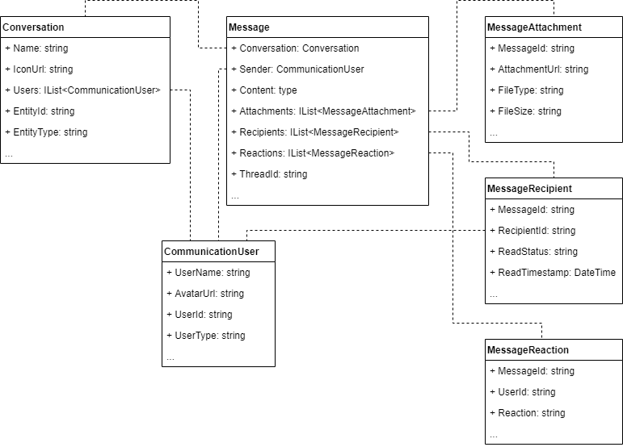

# VirtoCommerce Communication module data structure

All classes shown in the diagram inherit from [AuditableEntity](https://github.com/VirtoCommerce/vc-platform/blob/master/src/VirtoCommerce.Platform.Core/Domain/AuditableEntity.cs); to simplify the diagram, the AuditableEntity fields are not shown in it.

The [Message](https://github.com/VirtoCommerce/vc-module-communication/blob/master/src/VirtoCommerce.CommunicationModule.Core/Models/Message.cs) is the fundamental concept in VirtoCommerce Communication. The informaytion that the sender wants to convey to the recipient (or recipients) is the message. The information is contained in the Content field.

Messages are grouped into [Conversations](https://github.com/VirtoCommerce/vc-module-communication/blob/master/src/VirtoCommerce.CommunicationModule.Core/Models/Conversation.cs), which are used to logically group all correspondence. Conversations involve users, which allows information to be filtered when requested to ensure privacy.

A conversation can have a conversation entity, which is the context. The same users can talk about different entities, or even without any context - these are different conversations. The conversation entity can be any VirtoCommerce object, for this its type and identifier are stored.

[CommunicationUser](https://github.com/VirtoCommerce/vc-module-communication/blob/master/src/VirtoCommerce.CommunicationModule.Core/Models/CommunicationUser.cs) - a participant in a conversation, its type is not limited to an employee of the organization to which the user belongs. It can also be a customer, or even an entire organization when the correspondence is conducted on behalf of the company. Potentially, this is not only an authorized VirtoCommerce user, but also an anonymous user who has left their contact information for a response.

