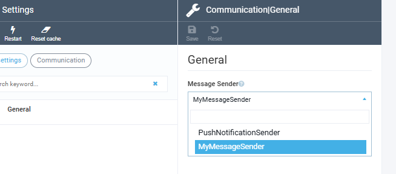

# How to create your own sending way

When a user writes a message to someone, this message is not simply saved in the system, it is actually "sent" to the recipients. At the moment, the VirtoCommerce Communication module has only one method of delivering messages to users - using the PushNotification system in the application in which the recipient is authorized.

However, a developer can create his own system for delivering messages to recipients. What is needed for this?

## Create your own class implementing _IMessageSender_

When creating a class, you should pay attention to the SenderName - this is the name under which your custom sender will appear in the system.

`MyMessageSender.cs`
```cs
public class MyMessageSender : IMessageSender
{
    public virtual string SenderName { get; } = nameof(MyMessageSender);
    public virtual SettingDescriptor[] AvailableSettings { get; set; }
    public virtual async Task<SendMessageResult> SendMessage(Message message)
    {
        // This is where all the magic that the class is created for will be located.
        // Sending an email, message in Viber or Teams -
        // any system that has the ability to integrate can potentially be used to deliver a message
    }
}
```

## Register class in Module.cs

This stage consists of two steps, both of which are done in your project's _Module.cs_ file.

`Module.cs`
```cs
public void Initialize(IServiceCollection serviceCollection)
{
    ...
    // In the Initialize method, you need to add your class to the services collection.
    serviceCollection.AddTransient<MyMessageSender>();
    ...
}
public void PostInitialize(IApplicationBuilder appBuilder)
{
    ...
    // In the PostInitialize method you need to register it
    var messageSendersRegistrar = appBuilder.ApplicationServices.GetService<IMessageSenderRegistrar>();
    messageSendersRegistrar.Register<MyMessageSender>(() => appBuilder.ApplicationServices.GetService<MyMessageSender>());
    ...
}
```
## Select new class in the settings

After system restart, go to the settings of the Communications Module and select your class - this will tell the system that it will now be used to send messages.



After this, the messages will be delivered in the manner described in the SendMessage method of your _MyMessageSender_ class.


